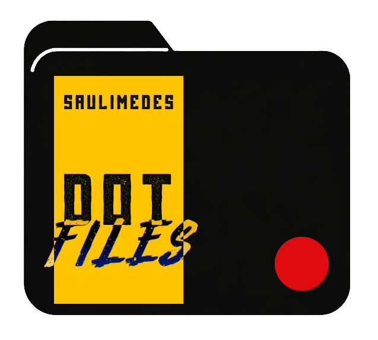

# Dotfiles


<p align="center">
  
</p>

## About

This repo is a collection of all my dotfiles managed by chezmoi.

## Installation

```shell
sh -c "$(curl -fsLS get.chezmoi.io)" -- init saulimedes --apply
```
